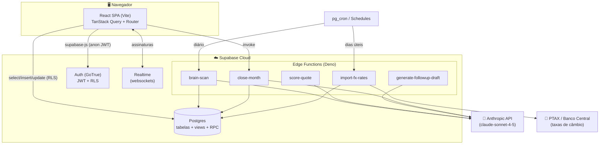
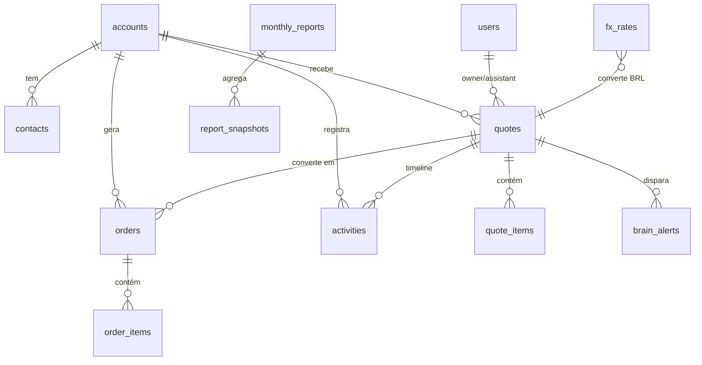
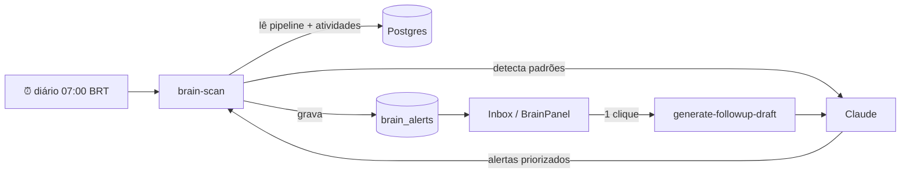
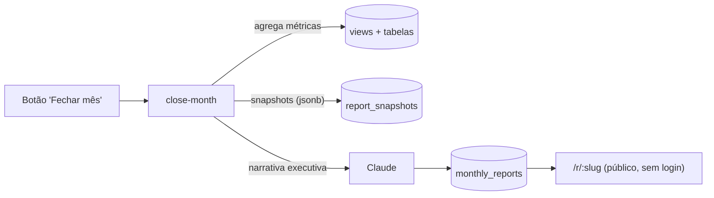

# Arquitetura — CRM PLP Export

> Sistema de gestão de cotações e pedidos de exportação da **PLP Brasil**, com
> camada de inteligência (Claude) que monitora o pipeline e gera relatórios.

Este documento descreve **como o sistema é montado e por quê**. Decisões com
trade-offs relevantes ficam registradas como [ADRs](docs/adr/).

---

## 1. Visão geral (containers)



| Camada | Tecnologia | Responsabilidade |
|---|---|---|
| **Frontend** | React 18 + Vite + TypeScript + Tailwind | UI, estado de servidor (TanStack Query), rotas |
| **Dados/Auth** | Supabase (Postgres + GoTrue) | Persistência, autenticação, autorização via RLS |
| **Lógica assíncrona** | Edge Functions (Deno) | IA, fechamento de mês, ingestão de câmbio |
| **IA** | Anthropic Claude | Alertas, scoring, drafts, narrativa de relatório |
| **Tipos** | `@crm-plp/shared` (Zod) + `database.types.ts` | Contrato único entre front, banco e funções |

---

## 2. Modelo de dados



Tabelas: `users`, `accounts`, `contacts`, `quotes`, `quote_items`, `orders`,
`order_items`, `activities`, `brain_alerts`, `monthly_reports`,
`report_snapshots`, `fx_rates`.

**Views** (cálculo no banco, próximo do dado):

| View | Serve | Cálculo-chave |
|---|---|---|
| `v_pipeline_active` | Kanban / Inbox | dias no estágio, valor em BRL, alerta ativo |
| `v_account_health` | Página de contas | pipeline aberto, hit-rate, contagens |
| `v_country_metrics` | Mapa-múndi (90 dias) | valor cotado/pedido e hit-rate por país |
| `v_monthly_kpis` | Dashboard (12 meses) | recebidas/enviadas/pedidos por mês |

**Funções**: `auto_stall_quotes()` e `auto_expire_stalled()` movem cotações
paradas; `get_fx_rate(currency, date)` resolve a taxa vigente.

---

## 3. Fluxo de autenticação e autorização

```mermaid
sequenceDiagram
    participant U as Usuário
    participant SPA
    participant Auth as Supabase Auth
    participant PG as Postgres (RLS)

    U->>SPA: e-mail + senha
    SPA->>Auth: signInWithPassword
    Auth-->>SPA: JWT (access + refresh)
    Note over SPA: AuthProvider guarda a sessão;<br/>trigger handle_new_user cria linha em public.users
    SPA->>PG: select/insert (Authorization: Bearer JWT)
    PG-->>PG: políticas RLS por papel (owner/assistant)
    PG-->>SPA: apenas linhas permitidas
```

A autorização **não vive no frontend** — vive nas políticas RLS
(`20240101000002_rls.sql`). O JWT carrega o papel; o Postgres decide.

---

## 4. A "Brain" (camada de IA)



- **`brain-scan`** — varre o pipeline e cria `brain_alerts` (cotação esfriando,
  alto valor parado, anomalia, oportunidade, risco de prazo).
- **`score-quote`** — probabilidade de fechamento de uma cotação.
- **`generate-followup-draft`** — rascunho de follow-up a partir do alerta.
- **`priorityScore()`** (cliente, `lib/utils.ts`) — ordenação determinística do
  Inbox combinando valor (log), tempo no estágio e alerta ativo. Coberto por
  testes unitários.

---

## 5. Pipeline do relatório mensal



Os snapshots são JSON versionado por métrica (`kpis`, `by_country`,
`top_quotes_won`, …) — contrato tipado em `@crm-plp/shared` (`ReportKpis`).

---

## 6. Mapa do código

```
crm-plp/
├── apps/web/                 # SPA React
│   └── src/
│       ├── components/        # UI reutilizável (Kanban, WorldMap, BrainPanel…)
│       ├── hooks/             # 1 hook por agregado (useQuotes, useOrders…) — TanStack Query
│       ├── lib/               # supabase client tipado, auth, theme, utils, seed
│       │   └── database.types.ts   # ← schema do Postgres em TypeScript
│       └── pages/             # 1 componente por rota
├── packages/shared/           # Tipos Zod + interfaces de domínio (front ⇄ funções)
├── supabase/
│   ├── migrations/            # schema versionado (SQL)
│   └── functions/             # Edge Functions (Deno)
└── .github/workflows/ci.yml   # typecheck → lint → test → build
```

**Convenções**
- Estado de servidor sempre via TanStack Query (sem `useEffect` para fetch).
- Toda chamada ao banco passa pelo client tipado em `lib/supabase.ts`.
- Tipos compartilhados moram em `@crm-plp/shared`; o schema físico em
  `database.types.ts` (regerável via `supabase gen types`).

---

## 7. Portões de qualidade

Rodam localmente (`pnpm …`) e no CI a cada push/PR:

| Portão | Comando | Garante |
|---|---|---|
| Tipos | `pnpm --filter web typecheck` | type-safety ponta a ponta, 0 erros |
| Lint | `pnpm --filter web lint` | 0 warnings (`--max-warnings 0`) |
| Testes | `pnpm --filter web test` | lógica de negócio (Vitest) |
| Build | `pnpm --filter web build` | bundle de produção íntegro |

Decisões arquiteturais detalhadas: **[docs/adr/](docs/adr/)**.
